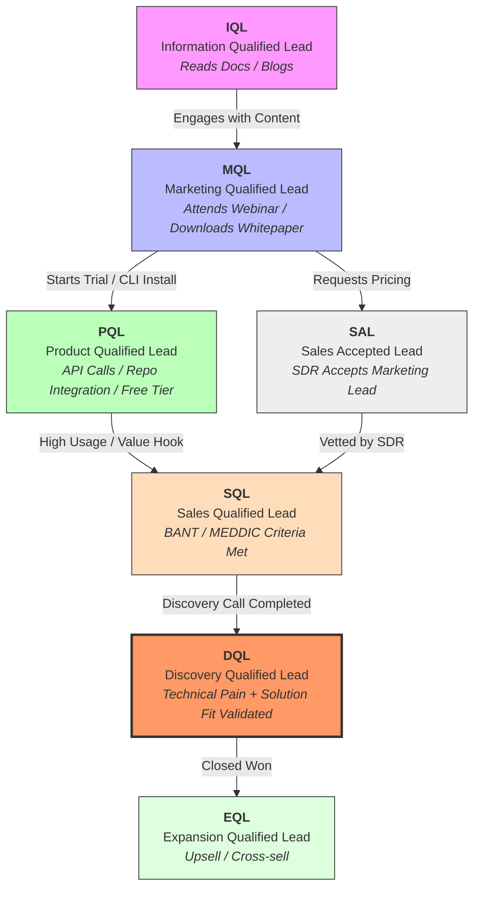

For the time being this is just a little guide on the various flavors of QLs for beginners, but I have more to add here about _how_ to work with Revenue teams effectively on data stuff soon. At a large enough company, you're going to get some really sharp developers who have transitioned to Sales, seek them out, they make great partners.

In the dev tools space, **PQLs** (Product Qualified Leads) and **DQLs** (Discovery Qualified Leads) are often the most critical metrics because technical leadership really wants to kick the tires on a product. They're not going to be happy until they've identified at least a handful of asks they want to add to your roadmap ☺️, so don't take it personally.

## B2B SaaS QL Lifecycle

  

## QList

| Metric | Full Name                  | Context in SaaS/DevTools                                                                                                                                                         |
| ------ | -------------------------- | -------------------------------------------------------------------------------------------------------------------------------------------------------------------------------- |
| IQL    | Information Qualified Lead | Someone reading your API documentation or technical blog posts. They are looking for a solution but haven't identified your tool as the winner yet.                              |
| MQL    | Marketing Qualified Lead   | A lead that fits your Ideal Customer Profile (ICP)—e.g., "Senior DevOps at a Series B startup"—and has engaged with marketing (e.g., attended a demo webinar).                   |
| PQL    | Product Qualified Lead     | **The "Gold Standard" for DevTools.** A user who has integrated your SDK, made X number of API calls, or invited their team to a workspace. They have reached the "Aha!" moment. |
| SAL    | Sales Accepted Lead        | A buffer stage where an Account Executive (AE) or SDR acknowledges an MQL/PQL and commits to reaching out within a specific SLA (e.g., 24 hours).                                |
| SQL    | Sales Qualified Lead       | A lead that has passed a "qualification framework" (like BANT or MEDDIC). They have the budget and authority to actually sign a contract.                                        |
| DQL    | Discovery Qualified Lead   | A lead that has completed a **Discovery Call**. In B2B, this means the salesperson has confirmed the specific technical pain points and mapped them to your product's features.  |
| EQL    | Expansion Qualified Lead   | An existing customer who is hitting usage limits (e.g., data ingestion caps) or needs "Enterprise" features like SSO/SAML, signaling an upsell opportunity.                      |
### DQLs in SaaS Land

In B2B SaaS, especially for dev tools, you see **DQL** a _lot_. This varies between companies of course, but the technical depth of a B2B SaaS dev tool means a sizable account converting without going through some kind of discovery session is a rarity. If somebody is going to spend real money with you, they're going to want to poke around with somebody. A **DQL** (versus just being BANT checked by an SDR as an **SQL**) is the more meaningful milestone for engineering-adjacent teams because it signifies that the team has also vetted the prospect's security, stack compatibility, scalability, response to the full product, etc., and the tool is a confirmed fit for them.

Also, DQLs make me think about DQ and want soft serve.🍦